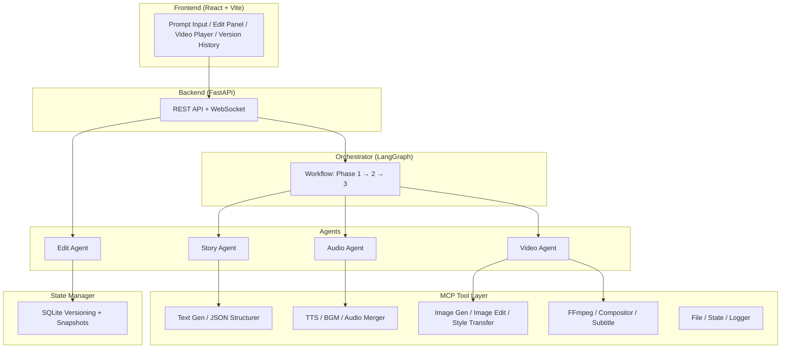

# Implementation Walkthrough

## What Was Built

A complete **AI-Powered Animated Video Generation System** — from prompt to polished short film — across 5 phases.

## Architecture



## Files Implemented (48 files)

### Foundation (8 files)
| File | Purpose |
|:--|:--|
| `shared/schemas/story.py` | Character, Scene, DialogueLine, StoryOutput models |
| `shared/schemas/audio.py` | AudioSegment, SceneTiming, TimingManifest models |
| `shared/schemas/video.py` | VideoScene, PortraitOverlay, CompositionConfig |
| `shared/schemas/edit.py` | EditIntent model |
| `shared/schemas/pipeline.py` | PipelineState master state |
| `shared/config.py` | Central config from .env |
| `mcp/base_tool.py` | BaseTool with async-safe `to_langchain_tool()` |
| `mcp/tool_registry.py` + `tool_executor.py` | Tool registry and executor |

### MCP Tools (12 files)
| File | Purpose |
|:--|:--|
| `mcp/tools/llm_tools/text_generator.py` | Gemini + Groq fallback |
| `mcp/tools/llm_tools/json_structurer.py` | Pydantic schema enforcement |
| `mcp/tools/audio_tools/tts_tool.py` | edge-tts + word timestamps + voice matching |
| `mcp/tools/audio_tools/bgm_tool.py` | Mood-based BGM selection |
| `mcp/tools/audio_tools/audio_merger.py` | pydub merge + BGM overlay |
| `mcp/tools/vision_tools/image_gen_tool.py` | Pollinations.ai + retry + fallback |
| `mcp/tools/vision_tools/image_edit_tool.py` | 10 OpenCV filters |
| `mcp/tools/vision_tools/style_transfer.py` | Style consistency |
| `mcp/tools/video_tools/ffmpeg_tool.py` | Ken Burns, overlay, merge, subtitles, speed |
| `mcp/tools/video_tools/compositor_tool.py` | MoviePy final concat |
| `mcp/tools/video_tools/subtitle_tool.py` | SRT merge with offsets |
| `mcp/tools/system_tools/` | File, state, logger tools |

### Agents (10 files)
| File | Purpose |
|:--|:--|
| `agents/story_agent/agent.py` | LLM → StoryOutput |
| `agents/audio_agent/agent.py` | Story → TimingManifest |
| `agents/video_agent/agent.py` | Ken Burns + overlays + subtitles → MP4 |
| `agents/edit_agent/intent_classifier.py` | LLM classification of edit queries |
| `agents/edit_agent/planner.py` | Intent → phase re-run plan |
| `agents/edit_agent/executor.py` | Execute edits via MCP tools |
| `agents/edit_agent/agent.py` | Full classify → plan → snapshot → execute |
| `agents/orchestrator/state.py` | LangGraph TypedDict |
| `agents/orchestrator/graph.py` | LangGraph state graph |
| `agents/orchestrator/workflow.py` | Sequential pipeline with progress callbacks |

### Backend (5 files)
| File | Purpose |
|:--|:--|
| `backend/app.py` | FastAPI entry point |
| `backend/routes/api.py` | REST endpoints (generate, edit, revert, versions) |
| `backend/services/session.py` | In-memory session store |
| `backend/websocket/handler.py` | WebSocket progress broadcasting |

### Frontend (4 files)
| File | Purpose |
|:--|:--|
| `frontend/src/App.jsx` | Main React app with all UI panels |
| `frontend/src/index.css` | Premium dark theme with animations |
| `frontend/vite.config.js` | Vite + API proxy |
| `frontend/index.html` | Entry HTML with Inter font |

### State Manager (4 files)
| File | Purpose |
|:--|:--|
| `state_manager/storage.py` | SQLite backend |
| `state_manager/snapshot.py` | Asset snapshot/restore |
| `state_manager/history.py` | Version diffs |
| `state_manager/state_manager.py` | Facade class |

### Tests & Scripts (3 files)
| File | Purpose |
|:--|:--|
| `agents/edit_agent/tests/test_intent_classifier.py` | 12 parametrized test cases |
| `scripts/generate_mock_data.py` | Mock PipelineState generator |
| `pyproject.toml` | pytest asyncio_mode=auto |

## Verification Results

| Check | Status |
|:--|:--|
| All Python imports | ✅ Pass |
| Mock data generation | ✅ Generates valid JSON |
| pip install | ✅ All deps installed |
| npm install | ✅ Frontend deps installed |
| FastAPI app creation | ✅ App object loads |

## How to Run

### Prerequisites
1. **FFmpeg** on PATH: `ffmpeg -version`
2. **API Key**: Edit `.env` with your `GOOGLE_API_KEY` from [aistudio.google.com](https://aistudio.google.com)

### Backend
```bash
cd FinalProject
uvicorn backend.app:app --reload --host 0.0.0.0 --port 8000
```

### Frontend
```bash
cd FinalProject/frontend
npm run dev
```

### Open in browser
Navigate to `http://localhost:3000`
